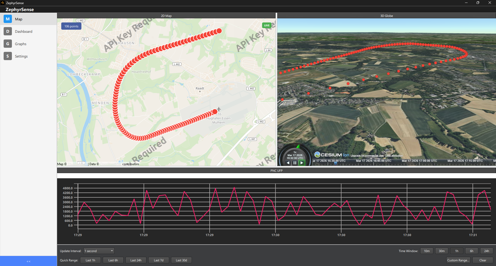

# ZephyrSense

A Qt/QML desktop application for real-time and historical visualization of geospatial environmental sensor data transmitted from drone-mounted measurement instruments over USB-Serial.

---

## Table of Contents

- [ZephyrSense](#zephyrsense)
  - [Table of Contents](#table-of-contents)
  - [Overview](#overview)
  - [Features](#features)
  - [Screenshots](#screenshots)
  - [Architecture](#architecture)
    - [Threading Model](#threading-model)
  - [Sensor Data](#sensor-data)
    - [Hazard Levels](#hazard-levels)
  - [Prerequisites](#prerequisites)
  - [Building](#building)
    - [Debug Build](#debug-build)
    - [Release Build \& Deployment](#release-build--deployment)
    - [Web Assets (CesiumJS)](#web-assets-cesiumjs)
  - [Testing](#testing)
    - [Running Tests](#running-tests)
      - [Test Suites](#test-suites)
      - [Test Helpers (`tests/testhelpers.h`)](#test-helpers-teststesthelpersh)
    - [Code Coverage](#code-coverage)
  - [Project Structure](#project-structure)
  - [Key Components](#key-components)
    - [C++ Backend](#c-backend)
      - [Singletons (QML\_SINGLETON)](#singletons-qml_singleton)
      - [Data Models (QML\_ELEMENT)](#data-models-qml_element)
      - [`SensorReading` (Q\_GADGET)](#sensorreading-q_gadget)
      - [IOThread / IOWorker](#iothread--ioworker)
      - [CesiumWorker](#cesiumworker)
    - [QML Frontend](#qml-frontend)
      - [Views](#views)
      - [SensorConfigProvider](#sensorconfigprovider)
    - [CesiumJS 3D Map](#cesiumjs-3d-map)
  - [Configuration \& Persistence](#configuration--persistence)
  - [CI Pipeline](#ci-pipeline)
  - [Third-Party Libraries](#third-party-libraries)
  - [License](#license)

---

## Overview

ZephyrSense connects to drone-mounted environmental sensor hardware via USB-Serial and provides real-time monitoring across four integrated views:

- **Map View** — 2D sensor markers (OpenStreetMap) + 3D globe with flight-path visualization (CesiumJS)
- **Dashboard View** — Nine radial gauges showing the latest or a selected historical reading
- **Graphs View** — Dockable, time-series charts for all nine sensors
- **Settings View** — Serial port, CSV export, hazard thresholds, and display settings

All incoming readings are persisted in a local SQLite database so historical data can be reviewed at any time without an active serial connection. Readings can also be logged to CSV in real time.

**Target users:** Environmental Research Engineers

---

## Features

| Feature | Detail |
|---|---|
| Real-time serial ingestion | Binary 42-byte packed struct at 115200 baud, `<frame>` delimited |
| Live map tracking | Color-coded markers (green / yellow / red) based on configurable hazard thresholds |
| 3D globe visualization | CesiumJS with 30-second flight-path trail, terrain, and CZML bulk export |
| Historical playback | Date-range queries with preset windows (1 h, 6 h, 24 h, 7 d, 30 d) |
| Dockable charts | KDDockWidgets — drag, tab, float, and persist chart layouts across restarts |
| Hazard thresholds | Per-sensor Warning / Danger levels, bidirectional for temperature and humidity |
| SQLite persistence | Three named connections (UI reads, I/O writes, CZML generation) |
| CSV export | Append-mode with auto-header, configurable path, toggled at runtime |
| DB import / export | Backup and restore the SQLite file from the Settings view |
| Cesium Ion token | Runtime configuration with async validation against the Cesium server |
| LLVM source-based coverage | Line, region, and MC/DC coverage reports via `llvm-cov` |

---

## Screenshots

> **3D Map Preview**
>
> 

---

## Architecture

```
┌─────────────────────────────────────────────────────────────┐
│                     QML UI (Qt Quick)                        │
│  Main.qml → StackLayout                                      │
│  ├── MapView        (2D markers + CesiumJS WebEngineView)    │
│  ├── DashboardView  (9 RadialBarGauges)                      │
│  ├── SensorGraphsView (KDDockWidgets + TimeSeriesChart)      │
│  └── SettingsView   (Connection / Export / Thresholds / Display) │
└─────────────────────────────┬───────────────────────────────┘
                              │ Q_PROPERTY / Q_INVOKABLE / signals
┌─────────────────────────────▼───────────────────────────────┐
│                    C++ Singletons (QML_SINGLETON)            │
│  SerialHandler  DatabaseManager  CsvExporter  ThresholdManager │
│  CesiumBridge                                                │
└──┬─────────────┬──────────────────────────────┬────────────┘
   │QueuedConn   │QueuedConn                     │QueuedConn
┌──▼──────────┐ ┌▼──────────────────────────┐ ┌─▼───────────────┐
│  IOThread / │ │      CesiumWorker          │ │  AppWebProfile  │
│  IOWorker   │ │ (CZML gen, DB queries)     │ │  + WebChannel   │
│ (DB writes, │ │ Connection: "Cesium"       │ └─────────────────┘
│  CSV append)│ └────────────────────────────┘
│ Conn:"IOWorker"│
└─────────────┘

Web Layer (QtWebEngine embedded):
  TypeScript + CesiumJS 1.139 + Vite
  qt-bridge.ts ←→ QWebChannel ←→ CesiumBridge (C++)
  czml-handler.ts   live-tracker.ts (30 s trail)
```

### Threading Model

| Thread | Component | SQLite Connection |
|---|---|---|
| Main (UI) | SerialHandler, DatabaseManager (reads), CesiumBridge, QML | `"ZephyrSense"` |
| IOThread | IOWorker (DB inserts, CSV writes) | `"ZephyrSenseIOWorker"` |
| CesiumThread | CesiumWorker (CZML generation) | `"ZephyrSenseCesium"` |

Signal routing uses `Qt::QueuedConnection` so all I/O stays off the UI thread.

---

## Sensor Data

The firmware transmits a 42-byte packed struct at 115200 baud, framed by `<` and `>` delimiters:

```cpp
struct __attribute__((__packed__)) dataStruct {
    int      partectorNumber;  // Particle Number Concentration — #/cm³
    int      partectorDiam;    // Particle Mean Diameter        — nm
    float    partectorMass;    // PM0.3 mass concentration      — µg/m³
    float    grimmValue;       // GRIMM PNC                     — #/cm³
    float    temperature;      // Ambient temperature           — °C
    float    humidity;         // Relative humidity             — %
    float    pressure;         // Atmospheric pressure          — hPa
    float    altitude;         // GPS altitude                  — m
    float    latitude;         // GPS latitude                  — °
    float    longitude;        // GPS longitude                 — °
    uint16_t co2;              // CO₂ concentration             — ppm
};
```

Total frame: `<` + 42 bytes + `>` = 44 bytes.

### Hazard Levels

| Level | Color | Meaning |
|---|---|---|
| 0 — Normal | Green | All sensors within safe range |
| 1 — Warning | Yellow | At least one sensor exceeded its warning threshold |
| 2 — Danger | Red | At least one sensor exceeded its danger threshold |

The highest level reached by any enabled sensor determines the marker color. Thresholds are configurable per-sensor and persist between sessions.

**Default-enabled sensors:** PNC UFP, Ø UFP, PM0.3, PNC PM, CO₂
**Default-disabled:** Temperature, Humidity, Pressure, Altitude

---

## Prerequisites

| Tool | Version | Notes |
|---|---|---|
| Qt | 6.10.2 | `win64_msvc2022_64` binaries |
| CMake | 3.25+ | |
| Ninja | any | Recommended generator |
| LLVM / clang-cl | 18+ (21+ for MC/DC coverage) | MSVC ABI compatible |
| Node.js | 22 | For building CesiumJS web assets |
| npm | bundled with Node | |
| Python 3 | optional | Coverage summary script |

Qt modules required (beyond QtCore/Gui/Quick/QuickControls2):
`QtSerialPort`, `QtSql`, `QtLocation`, `QtPositioning`, `QtGraphs`, `QtWidgets`, `QtWebEngineQuick`, `QtWebChannel`, `QtNetwork`

---

## Building

### Debug Build

```bash
# From the repository root — build directory must exist
cd build
cmake -GNinja -DCMAKE_BUILD_TYPE=Debug \
      -DCMAKE_C_COMPILER=clang-cl \
      -DCMAKE_CXX_COMPILER=clang-cl ..
cmake --build . -j
```

In Debug mode `WEBDEV_MODE` defaults **ON**: the CesiumJS map loads from a Vite dev server at `http://localhost:5173`. Start the dev server first:

```bash
cd web && npm install && npm run dev
```

### Release Build & Deployment

```bash
cd build
cmake --fresh -GNinja -DCMAKE_BUILD_TYPE=Release \
      -DCMAKE_C_COMPILER=clang-cl \
      -DCMAKE_CXX_COMPILER=clang-cl ..
cmake --build . -j

# Deploy Qt runtime alongside the executable
C:\Qt\6.10.2\msvc2022_64\bin\windeployqt.exe \
    --release --qmldir ..\qml\ Release\appZephyrSense.exe
```

Release builds embed all web assets (CesiumJS + TypeScript bundles) directly into the Qt resource system via `rcc`. The `add_custom_command` in `CMakeLists.txt` automatically runs `npm ci && npm run build` and generates the `.qrc` file at build time.

**Force a web rebuild** without reconfiguring:

```bash
rm -rf web/dist build/web_resources.qrc
cmake --build build
```

### Web Assets (CesiumJS)

The web layer is a standalone Vite project under `web/`:

```bash
cd web
npm install       # install dependencies
npm run build     # production build → web/dist/
npm run dev       # dev server at http://localhost:5173
```

CMake build options:

| Option | Default | Description |
|---|---|---|
| `WEBDEV_MODE` | `ON` in Debug, `OFF` in Release | Use Vite dev server vs embedded resources |
| `BUILD_TESTS` | `OFF` | Build all 13 test suites |
| `ENABLE_COVERAGE` | `OFF` | Enable LLVM source-based coverage instrumentation |

---

## Testing

### Running Tests

```bash
cd build
cmake -GNinja -DCMAKE_BUILD_TYPE=Debug \
      -DCMAKE_C_COMPILER=clang-cl \
      -DCMAKE_CXX_COMPILER=clang-cl \
      -DBUILD_TESTS=ON ..
cmake --build . -j
ctest --output-on-failure
```

For CI / headless environments set `QT_QPA_PLATFORM=offscreen`.

#### Test Suites

**C++ (12 suites):**

| Suite | What it covers |
|---|---|
| `tst_thresholdmanager` | Hazard levels, bidirectional thresholds, QSettings persistence |
| `tst_sensorreading` | Q_GADGET field values |
| `tst_coordinatevalidation` | Lat/lon range, null-island rejection |
| `tst_serialhandler` | Frame parsing, recovery, baud rate (`ZEPHYR_TESTING`) |
| `tst_databasemanager` | Queries, DB export/import, error paths |
| `tst_ioworker` | DB inserts and CSV writes on worker thread |
| `tst_csvexporter` | Property signals, URL conversion |
| `tst_sensorreadingmodel` | Model roles, coordinate filtering, hazard levels |
| `tst_timeserieschartmodel` | Bounds calculation, column data (`ZEPHYR_TESTING friend`) |
| `tst_iothread` | Thread lifecycle, start/stop signals |
| `tst_cesiumworker` | CZML generation, hazard color assignment |
| `tst_cesiumbridge` | Live/historical state machine, WebChannel handshake |

**QML (1 runner, ~58 test functions across 12 files):**

`tst_ModeBadge`, `tst_NavigationDrawer`, `tst_SensorLegend`, `tst_DateTimePicker`, `tst_DashboardLogic`, `tst_MapViewLogic`, `tst_GraphsViewLogic`, `tst_RadialBarGauge`, `tst_ConnectionPanel`, `tst_ExportTab`, `tst_SensorDockChart`, `tst_TokenSetupPopup`

Mock singletons (`SerialHandler`, `DatabaseManager`, `CsvExporter`, `ThresholdManager`) shadow the production singletons under the `ZephyrSense` URI, keeping tests independent of C++ state.

#### Test Helpers (`tests/testhelpers.h`)

```cpp
SensorReadingBuilder{}
    .withAllSensors()
    .withCoordinates(48.8, 2.3)
    .build();                                  // SensorReading

TestDatabaseHelper db;                         // temp dir + schema
db.insertReading(reading);
db.rowCount();                                 // int

FrameBuilder{}.withDefaults().buildFrame();            // QByteArray
FrameBuilder{}.buildCorruptedFrame();
FrameBuilder{}.buildPartialFrame(20);
```

### Code Coverage

**C++ (LLVM source-based):**

```bash
cd build
cmake -GNinja -DCMAKE_BUILD_TYPE=Debug \
      -DCMAKE_C_COMPILER=clang-cl -DCMAKE_CXX_COMPILER=clang-cl \
      -DBUILD_TESTS=ON -DENABLE_COVERAGE=ON ..
cmake --build . -j
cd ..
.\scripts\run_coverage.ps1 -Open   # opens HTML report in browser
```

Requires LLVM 18+ (`llvm-profdata`, `llvm-cov`); LLVM 21+ for MC/DC metrics.
Summary JSON: `build/coverage/coverage-summary.json` (line, region, MC/DC rates).

**QML (qoverage — local only):**

```powershell
.\scripts\run_qml_coverage.ps1 [-Open]
```

Output: `build/coverage/qml-coverage.xml` (Cobertura format). Requires a `.venv/qoverage/` Python environment with qoverage installed.

---

## Project Structure

```
ZephyrSense/
├── src/
│   ├── bridge/            # CesiumJS WebEngine integration
│   │   ├── appwebprofile       # QML_SINGLETON wrapper for WebEngineProfile
│   │   ├── cesiumbridge        # Qt↔CesiumJS state machine (live/historical)
│   │   ├── cesiumworker        # Background CZML generation (dedicated thread)
│   │   └── zephyrschemehandler # zephyr:// custom URL scheme
│   ├── core/
│   │   ├── sensorreading       # Q_GADGET value type (11 sensor fields)
│   │   ├── thresholdmanager    # Hazard thresholds singleton (QSettings)
│   │   ├── dockstatetracker    # KDDockWidgets layout persistence
│   │   └── coordinatevalidator # lat/lon range + null-island checks
│   ├── data/
│   │   ├── databasemanager     # SQLite singleton (main thread, reads)
│   │   └── csvexporter         # CSV config and status singleton
│   ├── models/
│   │   ├── sensorreadingmodel  # QAbstractListModel for QML views
│   │   └── timeserieschartmodel # Time-series aggregation for charts
│   ├── serial/
│   │   └── serialhandler       # Binary serial frame parser singleton
│   └── threading/
│       ├── iothread            # QThread lifecycle manager
│       └── ioworker            # DB inserts + CSV writes (worker thread)
├── qml/
│   ├── Main.qml               # ApplicationWindow + StackLayout
│   ├── views/
│   │   ├── MapView.qml        # 2D map + CesiumJS WebEngineView
│   │   ├── DashboardView.qml  # 9 radial gauges (live / frozen)
│   │   ├── SensorGraphsView.qml # Dockable time-series charts
│   │   └── SettingsView.qml   # Configuration tabs
│   ├── components/            # 13 reusable UI components
│   │   ├── RadialBarGauge.qml
│   │   ├── SensorMarker.qml
│   │   ├── NavigationDrawer.qml
│   │   ├── SensorDockChart.qml
│   │   ├── DateTimePicker.qml
│   │   ├── ModeBadge.qml
│   │   ├── SensorLegend.qml
│   │   ├── TokenSetupPopup.qml
│   │   ├── ConnectionPanel.qml
│   │   └── {Connection,Export,Thresholds,Display}Tab.qml
│   └── data/
│       └── SensorConfigProvider.qml  # Single source of truth for 9 sensors
├── web/                       # CesiumJS TypeScript frontend
│   ├── src/
│   │   ├── main.ts            # Viewer init + Qt bridge wiring
│   │   ├── qt-bridge.ts       # QWebChannel connection
│   │   ├── czml-handler.ts    # CZML dataset management
│   │   ├── live-tracker.ts    # 30 s position trail
│   │   └── types.ts           # TypeScript interfaces
│   ├── dist/                  # Built output (~14 MB, embedded in Release)
│   ├── package.json
│   └── vite.config.ts
├── tests/
│   ├── testhelpers.h          # SensorReadingBuilder, TestDatabaseHelper, FrameBuilder
│   ├── tst_*.cpp              # 12 C++ test suites
│   └── qml/                   # QML test suite
│       ├── setup/             # tst_qml_setup.cpp + mocks.h
│       └── tst_*.qml          # 12 QML test files
├── scripts/
│   ├── run_coverage.ps1       # LLVM coverage collection + HTML report
│   ├── run_qml_coverage.ps1   # QML coverage via qoverage
│   ├── coverage_summary.py    # JSON summary from llvm-cov export
│   └── filter_qmllint_ci.ps1  # qmllint CI filter
├── libs/
│   └── KDDockWidgets-2.4.0/   # KDAB docking framework (bundled)
├── docs/                      # Architecture plans and PRD
├── .github/workflows/ci.yml   # GitHub Actions CI
├── CMakeLists.txt
├── main.cpp                   # Application entry point
└── Main.qml                   # Root QML (also at repo root for qt_add_qml_module)
```

---

## Key Components

### C++ Backend

#### Singletons (QML_SINGLETON)

| Class | Purpose |
|---|---|
| `SerialHandler` | Parses binary serial frames; exposes `availablePorts`, `connected`, `baudRate`; emits `newReading(SensorReading)` |
| `DatabaseManager` | SQLite read interface; `getReadingsInRange()`, `exportDatabase()`, `importDatabase()` |
| `CsvExporter` | CSV export toggle and file path; delegates writes to `IOWorker` |
| `ThresholdManager` | Hazard thresholds and sensor enable state; `computeHazardLevel()`, `getColorForSensor()` |
| `CesiumBridge` | Qt↔CesiumJS WebChannel bridge; live/historical state machine; `loadRange()`, `czmlReady` signal |

#### Data Models (QML_ELEMENT)

| Class | Purpose |
|---|---|
| `SensorReadingModel` | `QAbstractListModel` for map markers and dashboard; supports live updates and historical queries |
| `TimeSeriesChartModel` | Time-series aggregation for chart rendering; exposes x/y bounds and column data |

#### `SensorReading` (Q_GADGET)

Value type passed between all layers — eleven typed `Q_PROPERTY` members matching the firmware struct plus a `QDateTime` timestamp.

#### IOThread / IOWorker

`IOWorker` runs on a dedicated `QThread`. All database inserts and CSV appends are dispatched via `Qt::QueuedConnection` from the main thread, keeping the UI responsive even under sustained ingestion loads.

#### CesiumWorker

A second dedicated thread handles CZML generation from database range queries. Each `loadRange()` call is non-blocking; results arrive via the `czmlReady(QString, int)` signal routed through `CesiumBridge`.

### QML Frontend

All QML files enforce four pragmas for type safety and ahead-of-time compiler compatibility:

```qml
pragma ComponentBehavior: Bound
pragma FunctionSignatureBehavior: Enforced
pragma NativeMethodBehavior: AcceptThisObject
pragma ValueTypeBehavior: Addressable
```

#### Views

**MapView** — Hosts both an OpenStreetMap `Map` (with `SensorMarker` items from `SensorReadingModel`) and a `WebEngineView` for the 3D CesiumJS globe. Switching between 2D and 3D is instantaneous. Clicking a marker freezes the Dashboard to that reading.

**DashboardView** — Nine `RadialBarGauge` components update at the configured live interval or display a static frozen reading. Hazard coloring is driven by `ThresholdManager`.

**SensorGraphsView** — Nine `SensorDockChart` docks (one per sensor), each backed by a `TimeSeriesChartModel`. Docks can be split, tabbed, or floated. Layout is persisted via `DockStateTracker`.

**SettingsView** — Four lazy-loaded tabs: serial connection, CSV export, hazard thresholds, display preferences. All settings persist via QSettings.

#### SensorConfigProvider

`qml/data/SensorConfigProvider.qml` is the single source of truth for all sensor metadata:

| Key | Display Name | Unit | Range |
|---|---|---|---|
| `partectorNumber` | PNC UFP | #/cm³ | 0 – 500 000 |
| `partectorDiam` | Ø UFP | nm | 0 – 500 |
| `partectorMass` | PM0.3 | µg/m³ | 0 – 200 |
| `grimmValue` | PNC PM | #/cm³ | 0 – 200 000 |
| `temperature` | Temperature | °C | −20 – 60 |
| `humidity` | Humidity | % | 0 – 100 |
| `pressure` | Pressure | hPa | 900 – 1150 |
| `altitude` | Altitude | m | 0 – 8000 |
| `co2` | CO₂ | ppm | 0 – 10 000 |

### CesiumJS 3D Map

The 3D globe is a TypeScript + CesiumJS 1.139 application embedded in a `WebEngineView` and served via the custom `zephyr://` URL scheme. Communication with C++ uses `QWebChannel`:

```
CesiumBridge (C++) ←→ QWebChannel ←→ qt-bridge.ts ←→ main.ts
                                                    ←→ czml-handler.ts
                                                    ←→ live-tracker.ts
```

**Live mode:** each `newReading` signal generates an incremental CZML packet forwarded to the browser via `czmlPacket`. `live-tracker.ts` maintains a 30-second `SampledPositionProperty` trail.

**Historical mode:** `CesiumBridge.loadRange()` dispatches a DB query to `CesiumWorker` which returns the complete CZML document via `czmlReady`. `czml-handler.ts` replaces the entire `CzmlDataSource` to avoid stale entity state.

The `zephyr://` scheme handler serves files from Qt resources in Release and proxies to the Vite dev server in Debug (`WEBDEV_MODE=ON`).

---

## Configuration & Persistence

| Storage | What is persisted |
|---|---|
| SQLite (AppDataLocation) | All sensor readings with millisecond timestamps |
| QSettings (registry on Windows) | Threshold values, sensor enable flags, serial port, baud rate, CSV path/enabled, dock layout |
| Disk cache (512 MB) | WebEngine HTTP cache for CesiumJS tile requests |

The database path is set at startup:
```
AppDataLocation/ZephyrSense/data/zephyrsense.db
```

---

## CI Pipeline

GitHub Actions runs five jobs on every push/PR to `main`:

| Job | Runner | What it does |
|---|---|---|
| **Build** | `windows-latest` | Release build (clang-cl + LLVM 21, Qt 6.10.2, Node 22) |
| **Test** | `windows-latest` | Debug build with `BUILD_TESTS=ON`, `ctest --output-on-failure` (`QT_QPA_PLATFORM=offscreen`) |
| **QML Lint** | `windows-latest` | `qmllint` via `scripts/filter_qmllint_ci.ps1` |
| **C++ Lint** | `windows-latest` | `clang-tidy` against all `src/**/*.cpp` |
| **Clazy** | `ubuntu-latest` | Builds from source with level-2 clazy checks |
| **CodeQL** | `windows-latest` | Static security analysis for C++ and TypeScript |

---

## Third-Party Libraries

| Library | Version | License | Notes |
|---|---|---|---|
| [KDDockWidgets](https://github.com/KDAB/KDDockWidgets) | 2.4.0 | GPL v2+ / commercial | Bundled in `libs/`; FetchContent fallback if missing |
| [CesiumJS](https://cesium.com/platform/cesiumjs/) | 1.139.0 | Apache 2.0 | npm dependency; built into `web/dist/` |
| [vite-plugin-cesium-build](https://github.com/nshen/vite-plugin-cesium-build) | 0.7.2 | MIT | Vite plugin for Cesium asset bundling |
| Qt Framework | 6.10.2 | LGPL v3 / GPL v3 / commercial | `win64_msvc2022_64` binaries |

---

## License

ZephyrSense is licensed under the **GNU General Public License v3.0**. See [LICENSE](LICENSE) for the full text.
